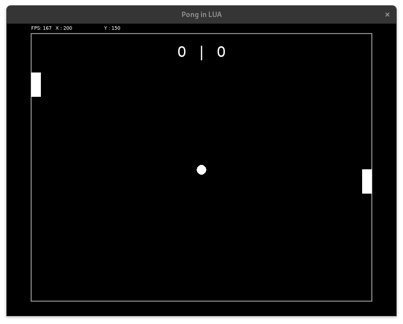

<h1 align="center">Simple Pong</h1>

<p align="center">Basic pong game designed to learn the fundamentals of LUA and the  <a href="the Love 2D library.">Love 2D</a> library.</p>
</img>


# Compilation

You need the Love2d library package installed :

```bash
love game/
```

or use the [AppImage](https://github.com/love2d/love/releases/download/11.5/love-11.5-x86_64.AppImage) :

```bash
./love-11.5-x86_64.AppImage game/
```
